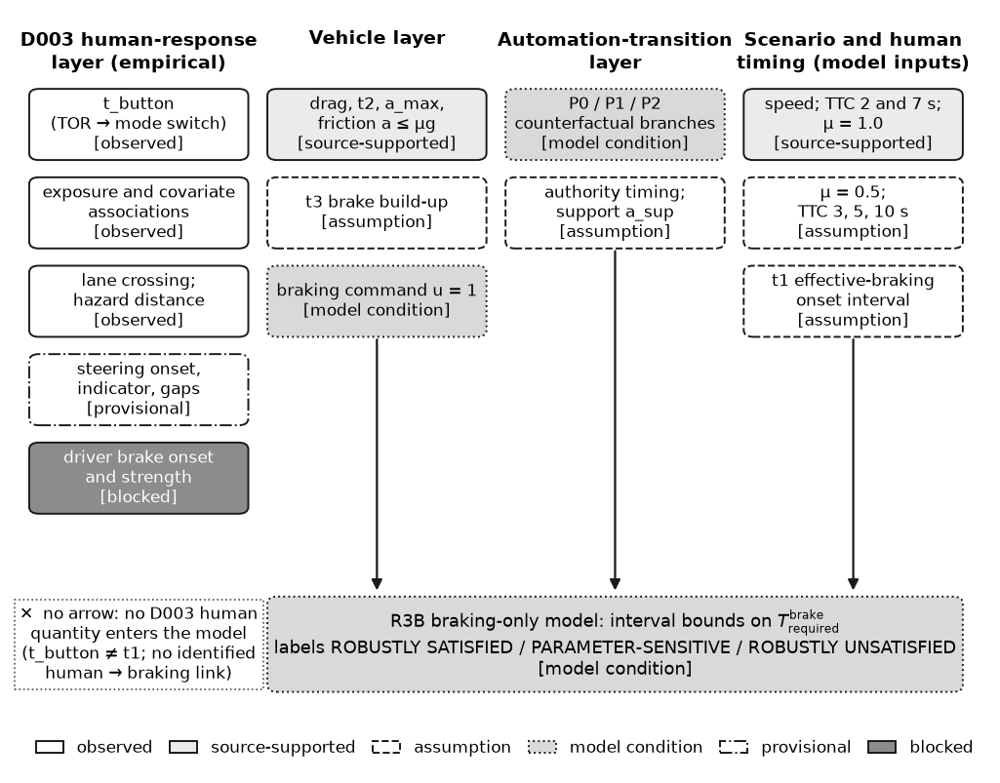
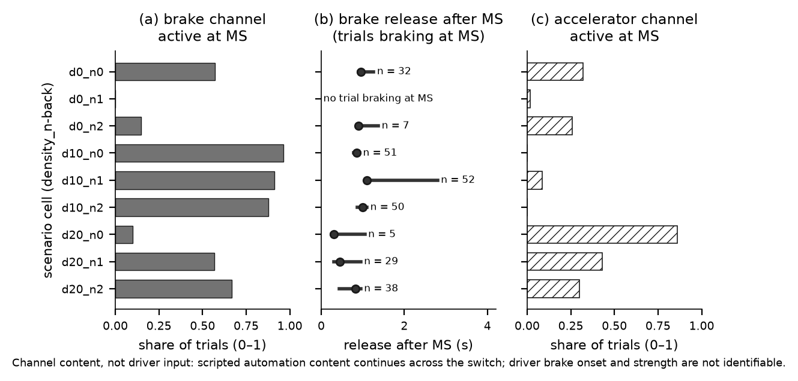
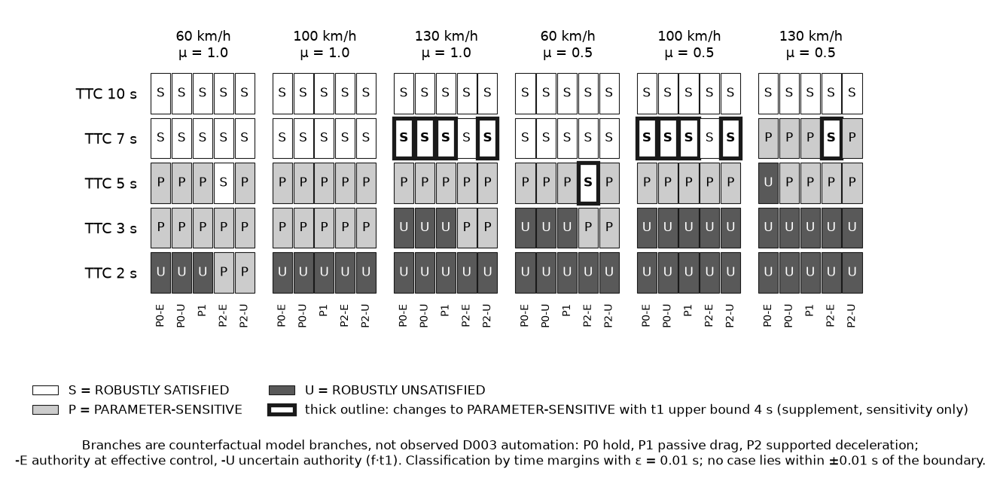
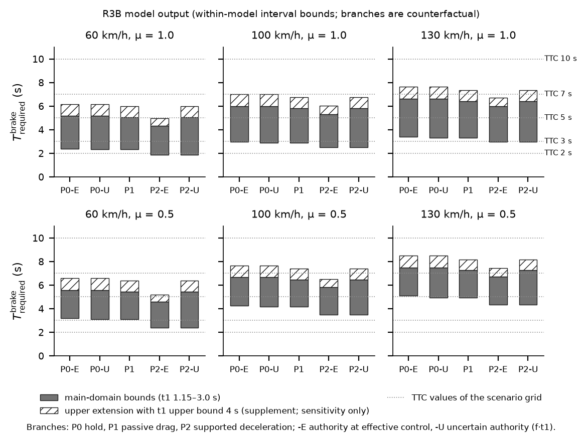
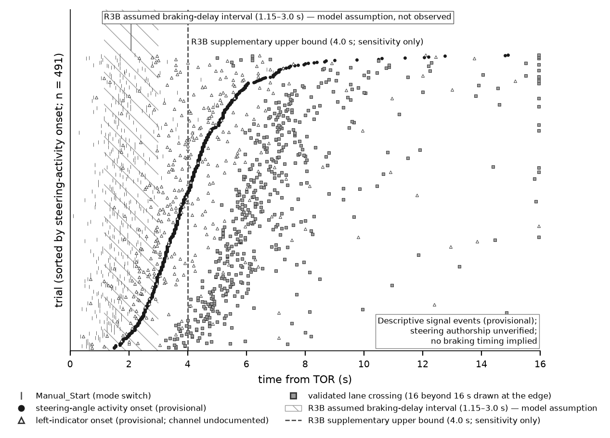
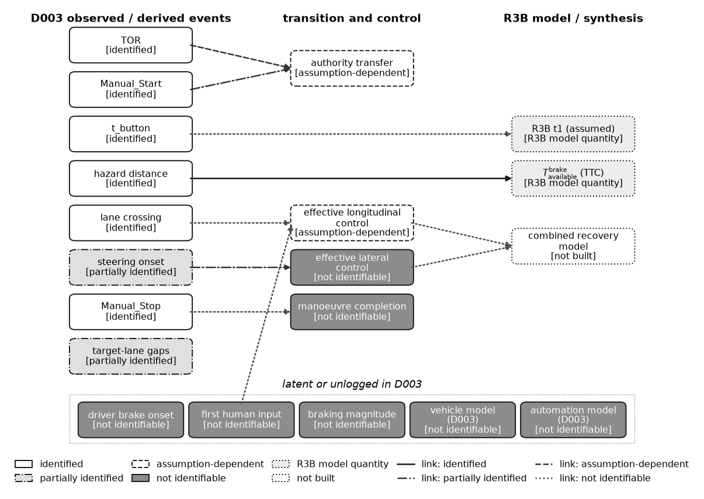

# Vehicle-Aware Human Fallback: Braking-Only Recoverability and Evidence-Boundary Analysis

**Repository:** `vehicle-aware-human-fallback`
**Author:** Fengzhe Li
**License:** MIT (Source Code)
**Python Version:** Python >= 3.10 (tested on Python 3.14.5)

---

## Research Question

> Under what combinations of vehicle dynamics, human driver capability, handover policy, and scenario criticality does human fallback remain an effective and physically recoverable safety mechanism during time-critical automated-driving takeovers?

In Level 3 (conditionally automated) driving, when an automated driving system reaches its operational design domain (ODD) limit or detects an unmanageable hazard, it issues a Takeover Request (TOR) to transition control authority to the human driver. Conventional safety engineering often evaluates takeover safety primarily through *takeover lead time* (e.g., Time-to-Collision at TOR). This project investigates whether fallback recoverability is governed by joint physical interactions among:
1. **Vehicle braking capability and road friction** ($\mu$, $a_{\max}$, actuator delay, hydraulic pressure rise);
2. **Human response latency and action sequencing** ($t_{\text{button}}$, brake onset, steering onset);
3. **Control authority transition policies** (timing of automation authority withdrawal vs. effective human input); and
4. **Initial kinematic state and scenario criticality** ($v_0$, TTC, road stationing).

---

## What This Repository Contains

This repository contains the complete open-source scientific codebase, verification test suite, derived analytical datasets, claim ledger, and deterministic figure-generation pipelines for the project:

- **D003 Evidence and Observability Audit:** A complete signal-processing and control-channel audit of the TU Delft conditionally automated driving takeover simulator dataset (D003; Happee et al.), analyzing 513 trials across 57 participants.
- **Human Response Timing Analysis:** Empirical distributions of driver mode-switch button response times ($t_{\text{button}}$), repeated-exposure practice slopes, and carry-over sensitivity models across consecutive TOR exposures.
- **Vehicle and Automation Parameter Evidence:** Road-load deceleration models calibrated from official EPA certification test data, paired with physical braking limits (Coulomb friction caps $\mu g$, hydraulic actuation delay $t_2$, deceleration rise time $t_3$).
- **Deterministic Interval-Bounded Braking Model (Phase R3B):** An analytical, open-loop kinematic model calculating required stopping time $T_{\text{req}}$ and margin $\Delta T = \text{TTC} - T_{\text{req}}$ across parameter intervals, with closed-form coordinatewise-monotonicity guards.
- **P0/P1/P2 Counterfactual Transition Branches:** Three distinct handover authority policies modeling automation deceleration withdrawal relative to human control reacquisition.
- **Steering Sequence Descriptive Analysis (Phase R4V):** Empirical timing of lateral steering-angle activity onset relative to TOR, lane-marker crossing times, indicator activation, and along-road hazard station reconstruction.
- **Identifiability Boundary Analysis:** Formal classification of what can and cannot be mathematically identified or causally linked using public simulator telemetry alone.
- **Comprehensive Claim Ledger:** 42 formally audited, frozen claims ([`research/R5A_CLAIM_LEDGER.csv`](research/R5A_CLAIM_LEDGER.csv)) with explicit epistemic labels: 33 `EMPIRICAL_DESCRIPTIVE`, 2 `ANALYTICAL_CLOSED_FORM`, 3 `COUNTERFACTUAL_INTERVAL`, 4 `UNIDENTIFIABLE_OR_BLOCKED`.
- **Deterministic Thesis Figures:** Reproduction pipeline rendering 12 publication figures ([F1–F10, FA1–FA2](thesis/figures/)) with bit-identical PDF and PNG hash verification.


*Figure F1: Four-layer research framework separating vehicle response, human control reacquisition, transition policy, and scenario criticality, supported by an empirical observation layer and constrained by identifiability gates.*

---

## Main Findings (Grounded in Frozen Claim Ledger)

All findings reported below are strictly bounded by the frozen R5A Claim Ledger ([`research/R5A_CLAIM_LEDGER.csv`](research/R5A_CLAIM_LEDGER.csv)):

1. **Driver Mode-Switch Button Timing ($t_{\text{button}}$):**
   Across 492 anchorable D003 trials, mode-switch button actuation exhibits a median of **1.65 s** (IQR: 1.25–2.00 s; 5th–95th percentile: 0.95–2.90 s; Claim L03 notes button press is intent signaling, not hazard response time). Within participants, $t_{\text{button}}$ decreased modestly with repeated exposure (**$-0.033\text{ s}$ per exposure**, 95% CI $-0.058$ to $-0.007$; about $-0.26\text{ s}$ across 8 exposures; **associational only**; **Claim L01**).
2. **Inability to Identify Driver Braking in D003:**
   Longitudinal brake pedal telemetry in D003 is dominated by automated deceleration commands that straddle the mode switch (`Manual_Start`) and persist for up to $0.80\text{ s}$ into manual control (Claims L05, L06). Because the vehicle control state remains static (`state = 2.0`, Claim L07), independent human driver braking onset and pedal force cannot be identified from D003 telemetry (Claim L08).

   
   *Figure F3: Empirical telemetry traces across Manual_Start in D003, showing scripted automated deceleration commands persisting into the manual driving phase (Claims L05, L06).*

3. **Deterministic Braking Recoverability (R3B Interval Slices):**
   Across the **150 canonical scenario–friction–policy evaluation cases** (25 speed/TTC scenarios $\times$ 2 friction levels $\times$ 3 transition policies):
   - **58 cases** are **ROBUSTLY SATISFIED** ($\min \Delta T \ge 0.01\text{ s}$ across the full parameter interval);
   - **47 cases** are **PARAMETER-SENSITIVE** ($\min \Delta T < 0 < \max \Delta T$, where recoverability depends strictly on where actual human/vehicle parameters fall within the assumed bounds);
   - **45 cases** are **ROBUSTLY UNSATISFIED** ($\max \Delta T \le -0.01\text{ s}$ across the full parameter interval; Claims L19, L20).

   
   *Figure F5: Braking-only recoverability classification across 150 scenario cases: 58 robustly satisfied, 47 parameter-sensitive, and 45 robustly unsatisfied (Claim L19). S/P/U labels and grayscale intensity distinguish the three within-model classifications; these are necessary-condition results, not safety labels.*

   
   *Figure F6: Deterministic interval bounds on required stopping time $T_{\text{req}}$ versus available TTC, showing parameter sensitivity dominated by assumed human braking latency $t_1$ (Claims L20, L24).*

4. **TTC is the Dominant Longitudinal Separator:**
   Within the deterministic braking model, initial TTC is the primary determinant of recoverability. High-TTC scenarios ($\ge 5.0\text{ s}$) are robustly satisfied at moderate highway speeds, whereas short-TTC emergency scenarios ($\le 2.5\text{ s}$) cannot be recovered by braking alone on low-friction surfaces ($\mu = 0.5$) under any policy (Claims L20, L25).
5. **Friction and Delay Sensitivity:**
   Pavement friction coefficient $\mu$ caps achievable deceleration at $\mu g$, acting as a hard physical constraint regardless of chassis braking hardware capability $a_{\max}$ (Claims L22, L23). The width of the required braking time interval $[T_{\text{req},\min}, T_{\text{req},\max}]$ is heavily dominated by the assumed human braking latency window $t_1 \in [1.15, 3.00]\text{ s}$ (Claims L24, L26).
6. **Steering Activity Timing vs. Assumed Braking Window:**
   In D003, empirical steering-angle activity onset occurs at a median of **3.85 s** post-TOR (IQR: 3.00–4.88 s; Claim L09). Measured from TOR, descriptive steering-angle activity onset in D003 **falls predominantly after the upper end of the R3B assumed braking-delay interval** ($[1.15, 3.00]\text{ s}$): $75.4\%$ of onsets fall after $3.00\text{ s}$ with the primary detector ($n = 491$), none before $1.15\text{ s}$, and a majority for every detector compared ($57$–$87\%$) and in every scenario cell ($51$–$98\%$; Claim L41).
   *Required qualifiers (Claim L41):* This observation is a cross-layer descriptive comparison between an empirical lateral signal event and an exogenous longitudinal modelling assumption. R3B $t_1$ is a model assumption, not an observed braking delay; steering authorship is unverified (Claim L11); the exact fraction depends on the detector definition (Claim L09); and the majority relationship does not hold against the $4.0\text{ s}$ supplementary bound ($47\%$ after $4.0\text{ s}$). No driver braking timing is implied.

   
   *Figure F9: Empirical steering-angle activity onsets falling predominantly after the upper boundary of the assumed braking-delay window $[1.15, 3.00]\text{ s}$ (Claim L41; descriptive cross-layer comparison; no driver braking implied).*

7. **Combined Recoverability is Unidentifiable:**
   Because lateral hazard clearance margins, obstacle dimensions, and lane widths are missing from simulator logs, and independent driver braking is unobservable, joint longitudinal/lateral recoverability cannot be empirically validated without ungrounded synthetic assumptions (Claims L27, L29, L30).

---

## What the Project Does NOT Claim

To maintain strict scientific and assurance integrity, this project explicitly disclaims the following:

- **NO System-Level Safety Prediction:** The project does not predict real-world collision probabilities or claim that any vehicle or automation system is "safe" or "unsafe" (Claim L31).
- **NO Empirical Driver Braking Model:** No human braking reaction time distribution or brake pedal transfer function was fitted to D003, because driver braking inputs are confounded by automation script commands (Claims L05, L06).
- **NO Validated Combined (Braking + Steering) Envelope:** The project does not claim to have proven combined evasive trajectory recoverability. Longitudinal braking slices and descriptive lateral steering sequences are evaluated as separate, uncomposed evidence layers (Claim L30).
- **P0/P1/P2 are Counterfactual Model Branches:** The transition policies analyzed in Phase R3B are deterministic mathematical models representing hypothetical authority timing, not validated production controller software (Claims L24, L25).
- **R3B is a Necessary-Condition Analysis:** The deterministic braking model proves *necessary conditions* for stopping without collision; satisfying $T_{\text{req}} \le \text{TTC}$ does not guarantee safe operational recovery in complex traffic (Claims L19, L29).


*Figure F10: Identifiability boundary distinguishing identifiable analytical and descriptive quantities from blocked composite recoverability claims across simulator and physical domains.*

---

## Repository Structure

```text
├── docs/                     # Architectural baselines, decision records (D001-D038), audit logs
│   ├── DECISIONS.md          # Chronological record of all project decisions
│   ├── PROJECT_STATUS.md     # Phase ledger and milestone tracking
│   └── RESEARCH_ARCHITECTURE_V2.md # Four-layer closed-loop research framework
├── experiments/              # Legacy audit and analytical challenge documents (Phases A-H)
├── research/                 # Foundational research registries, charters, and claim ledgers
│   ├── R5A_CLAIM_LEDGER.csv  # Authoritative 42-claim ledger (L01-L42)
│   ├── R3A_SOURCE_REGISTER.csv # External literature and standards evidence base
│   └── data_matrix/          # D003 field audits, EPA coastdown parameter derivations
├── results/                  # Committed analytical outputs, summary tables, and figures
│   ├── R1_ingestion_validation/   # D003 ingestion QA and owner reconciliation
│   ├── R2A_event_vehicle_descriptives/ # Channel activity diagnostics & populations
│   ├── R2B_repeated_exposure/     # Exposure slope models & participant trends
│   ├── R2C_lite/                  # Carry-over sensitivity models
│   ├── R3B_braking_bounds/        # Deterministic interval braking bounds & CSVs
│   ├── R4V_channel_authorship/    # Control channel authorship validation
│   └── R4V_steering_sequence/     # Steering sequence descriptives & hazard reconstruction
├── src/                      # Project source code (Python package)
│   ├── data/                 # Strict D003 loader, population filters, QA pipelines
│   ├── driver/               # Parameterized driver response models
│   ├── experiments/          # Canonical experiment runners (R1, R2A, R2B, R2C, R3A, R3B, R4V)
│   ├── figures/              # R6A thesis figure rendering pipeline
│   ├── handover/             # Handover timeline models and policy definitions
│   ├── metrics/              # Control activity detectors, analytical derivatives, margins
│   ├── provenance/           # Structured metadata registries and report generators
│   └── vehicle/              # Physical vehicle models, road load, braking kinematics
├── tests/                    # Automated pytest suite (public clone: 424 passed, 11 skipped, 1 deselected)
├── thesis/
│   └── figures/              # 12 canonical frozen publication figures (PNG and PDF)
│       └── figure_manifest.json # Cryptographic SHA256 hashes of all figure outputs
├── .gitignore                # Production artifact exclusions and data protections
├── LICENSE                   # MIT License
├── pytest.ini                # Pytest configuration
├── README.md                 # Project overview and reproduction guide
└── requirements.txt          # Python package dependencies
```

---

## Installation

### Prerequisites
- Python 3.10 or higher (tested on Python 3.14.5)
- Standard virtual environment (`venv`)

### Setup Instructions
```bash
# 1. Clone the repository
git clone https://github.com/fengzhe-li/vehicle-aware-human-fallback.git
cd vehicle-aware-human-fallback

# 2. Create and activate a virtual environment
python3 -m venv .venv
source .venv/bin/activate

# 3. Upgrade pip and install dependencies
pip install --upgrade pip
pip install -r requirements.txt
```

---

## Running Tests

The test suite validates data ingestion, numerical derivatives, analytical monotonicity proofs, claim boundaries, and figure consistency:

```bash
# Run the complete test suite
pytest
```

**Expected output on a fresh public clone:**
```text
424 passed, 11 skipped, 1 deselected
```
The 11 skipped tests depend on material that is not distributed with this repository:

- **Embargoed thesis draft** — `tests/test_r6b_thesis.py` (21 tests) is skipped at module level while the thesis manuscript is under institutional examination; it is reported as 1 skip.
- **External D003 archive** — 9 tests in `test_d003_ingest.py`, `test_h1_sensitivity_and_audit.py`, `test_r2a.py`, `test_r2b.py` and `test_r2c_lite.py` read `data/external/d003/tu_delft_takeover.zip` (see [External Data Availability](#external-data-availability) for the download).
- **External EPA source file** — 1 test in `test_r3a.py` reads `data/external/epa/24-testcar-2025-05.xlsx`.

The 1 deselected test is excluded by default via `pytest.ini` (`-m "not r3b_study"`); it is an optional full numerical grid sweep.

A previous local, data-enabled run (external D003 and EPA files present, thesis draft absent) reported `434 passed, 1 skipped, 1 deselected`; that run was not independently re-run during the public-repository cleanup.

---

## Deterministic Figure Reproduction

All 12 thesis publication figures ([F1–F10, FA1–FA2](thesis/figures/)) can be deterministically rendered from stored analytical outputs:

```bash
# Render all figures into thesis/figures/
python3 -m src.figures.r6a_thesis_figures thesis/figures
```

Figure rendering is byte-deterministic: `tests/test_r6a_figures.py` re-renders every figure and checks that each output is byte-identical to the committed file. [`thesis/figures/figure_manifest.json`](thesis/figures/figure_manifest.json) records the SHA-256 of each figure's source inputs, which the same test verifies.

---

## External Data Availability

Raw third-party datasets are **not bundled** in this repository due to archive size and third-party provider terms:

1. **TU Delft Conditionally Automated Takeover Dataset (D003):**
   - **Authors:** R. Happee et al.
   - **Repository:** 4TU.ResearchData
   - **DOI:** [`10.4121/uuid:e853b4e6-cba0-4e13-ac4b-506716ddd0fb`](https://doi.org/10.4121/uuid:e853b4e6-cba0-4e13-ac4b-506716ddd0fb)
   - **License:** Open Access (CC BY 4.0)
   - **Placement:** Download `tu_delft_takeover.zip` and place in `data/external/d003/`.
2. **EPA Test Car Certification Database:**
   - **Source:** United States Environmental Protection Agency (EPA)
   - **Dataset:** 2024–2025 Light-Duty Test Car Database (`24-testcar-2025-05.xlsx`)
   - **License:** Public Domain (US Government Work)
   - **Placement:** Place in `data/external/epa/`.

---

## Reproducibility Scope

- **Committed Derived Results:** All derived CSV summaries, parameter tables, and statistical models in `results/` are committed directly to the repository. The verification test suite (`pytest`) and figure rendering pipeline (`r6a_thesis_figures.py`) execute without the 450 MB external raw data archive; the tests that need it are skipped.
- **Raw Ingestion Pipelines:** If raw source archives are placed in `data/external/`, the canonical ingestion pipeline (`src/data/d003_ingest.py`) and validation scripts can be re-executed from scratch.
- **Provenance note:** Result records retain the historical development commit (`code_commit`) from which an analysis was produced. These identifiers refer to pre-release development history and are intentionally not part of the curated public-release Git history. For R2A, R2B and R2C, equivalence of the run-relevant dependencies is verified in this release by content hash. Details: [docs/PROVENANCE.md](docs/PROVENANCE.md).

---

## Licensing

- **Project Source Code & Architecture:** Licensed under the [MIT License](LICENSE).
- **Third-Party Data:** External datasets (TU Delft D003 and EPA test car data) remain subject to their original source provider terms and licenses.
- **Analytical Outputs:** Derived summary tables and metrics in `results/` are provided for academic reproducibility under CC BY 4.0.

---

## Thesis Manuscript Notice

The full doctoral/master's thesis manuscript draft is **intentionally held from public release** pending institutional examination, defense, and degree award. This repository provides the complete open-source software, analytical data, and verification infrastructure supporting the dissertation.
